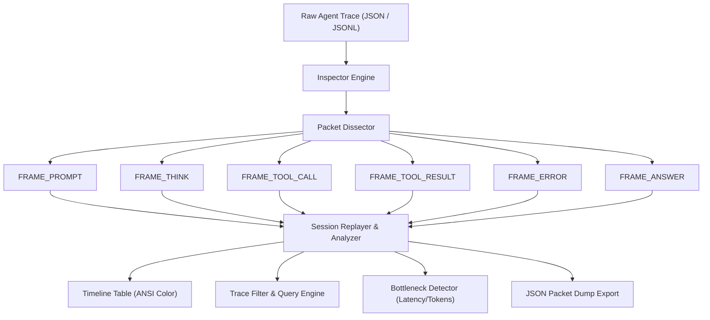

[🇸🇦 العربية](README.ar.md) | [🇬🇧 English](README.md)

# 🔍 eidcloud-agent-inspector

> **"Wireshark for AI Agents"** — Interactive packet-level debugger, session replay, and trace analyzer engine built in pure PHP 8.2+ with zero external dependencies.

[](https://github.com/shadialhasan/eidcloud-agent-inspector/releases)
[](https://www.php.net/)
[](LICENSE)
[](https://github.com/shadialhasan/eidcloud-agent-inspector/actions)
[](https://colab.research.google.com/github/shadialhasan/eidcloud-agent-inspector/blob/main/notebooks/quickstart.ipynb)

---

## 🌟 Overview

As autonomous agents execute complex multi-step reasoning, tool invocations, and API calls, diagnosing performance regressions, reasoning loops, and prompt bloat becomes challenging.

**eidcloud-agent-inspector** treats agent conversations and workflows just like network protocols. It discretizes agent executions into sequential, strongly-typed **packet frames** (`FRAME_PROMPT`, `FRAME_THINK`, `FRAME_TOOL_CALL`, `FRAME_TOOL_RESULT`, `FRAME_ANSWER`, `FRAME_ERROR`), allowing developers to:

- 🔬 **Sniff & Inspect**: Inspect agent execution traces with microsecond precision and token attribution.
- ⏯ **Session Replay**: Step through agent runs turn-by-turn or replay in real-time with configurable speed multipliers (`1x`, `2x`, `5x`, `0x`).
- ⚡ **Filter & Bottlenecks**: Query frames by tool name, latency thresholds, token volume, or failure flags.
- 📦 **Zero Dependencies**: Pure PHP 8.2+ standard library with full PSR-4 autoloading. Runs everywhere instantly.

---

## 🏗 Architecture & Packet Sniffer Model



---

## 🚀 Key Capabilities

| Feature | Description |
|---|---|
| **Packet-Level Modeling** | Dissects interactions into explicit frame types with metadata, timestamps, latency, and input/output tokens. |
| **Interactive Turn Replay** | Replays multi-agent conversations step-by-step or automatically with simulated timing and delay scaling. |
| **Multi-Format Ingestion** | Ingests JSON files, raw trajectories, turn arrays, or streaming JSONL (JSON Lines). |
| **Deep Query Filtering** | Filter by tool name regex, error state, frame types, duration, or payload string search. |
| **Bottleneck Analytics** | Instantly highlights slow tools, context explosions, and failed operations. |
| **Rich Terminal UI** | Formatted ANSI tables with status indicators, color-coded frames, and metrics summaries. |

---

## 💻 CLI Usage

The bundled CLI tool `bin/eidcloud-inspector` provides an intuitive interface:

```bash
# 1. Full Session Overview & Packet Timeline Table
php bin/eidcloud-inspector inspect examples/session_sample.json

# 2. Turn-by-Turn Session Replay (2x Speed)
php bin/eidcloud-inspector replay examples/session_sample.json --speed=2x

# 3. Instant Turn Replay (No Delay)
php bin/eidcloud-inspector replay examples/session_sample.json --speed=0x

# 4. Filter by Tool Name
php bin/eidcloud-inspector filter examples/session_sample.json --tool=filesystem

# 5. Filter Only Errors & Failures
php bin/eidcloud-inspector filter examples/session_sample.json --errors-only

# 6. Detect Performance Bottlenecks (Latency >= 1500ms or Tokens >= 2000)
php bin/eidcloud-inspector bottlenecks examples/session_sample.json --min-latency=1500 --min-tokens=2000

# 7. Export Sanitized Packet Dump to JSON
php bin/eidcloud-inspector inspect examples/session_sample.json --json > trace_dump.json
```

---

## 🧩 Programmatic PHP API

Use `eidcloud-agent-inspector` directly in your PHP applications:

```php
use EidCloud\AgentInspector\Inspector;
use EidCloud\AgentInspector\Packets\FrameType;

// Initialize inspector
$inspector = new Inspector();

// Load trace from JSON file or JSONL
$session = $inspector->loadFromFile('examples/session_sample.json');

// Display statistics
$stats = $session->getStatistics();
echo "Total Latency: " . $stats['total_latency_ms'] . " ms\n";
echo "Total Tokens : " . $stats['total_tokens'] . "\n";

// Query frames using fluent filter
$filtered = $inspector->filter($session)
    ->byTool('postgres_migrator')
    ->minLatency(1000.0)
    ->filterSession($session);

// Replay programmatically
$replayer = $inspector->createReplayer($session);
$replayer->replay(speedMultiplier: 0.0, onFrame: function ($frame, $index, $total) {
    echo "[{$index}/{$total}] {$frame->type->name}: {$frame->latencyMs}ms\n";
});
```

---

## 🧪 Running Tests

A self-contained zero-dependency test runner is included:

```bash
php tests/run_tests.php
```

All 10 tests verify packet parsing, type conversions, filtering criteria, bottleneck detection, replayer state transitions, and JSON exports with 100% pass rate.

---

## 📓 Interactive Notebook

Try the interactive Google Colab notebook:
[](https://colab.research.google.com/github/shadialhasan/eidcloud-agent-inspector/blob/main/notebooks/quickstart.ipynb)

Located at `notebooks/quickstart.ipynb`.

---

## 👤 Author & Maintainer

**Eng. MHD. Shadi AL-Hasan**  
- **Role:** Executive CTO & Enterprise Solutions Architect  
- **Email:** [mhd.shadi.alhasan@gmail.com](mailto:mhd.shadi.alhasan@gmail.com)  
- **Phone / WhatsApp:** [+963934005922](tel:+963934005922)  
- **Location:** Damascus, Syria  
- **GitHub:** [shadialhasan](https://github.com/shadialhasan)  

---

## 📄 License

This project is licensed under the MIT License - see the [LICENSE](LICENSE) file for details.  
Copyright (c) 2026 **MHD. Shadi AL-Hasan**. All rights reserved.
